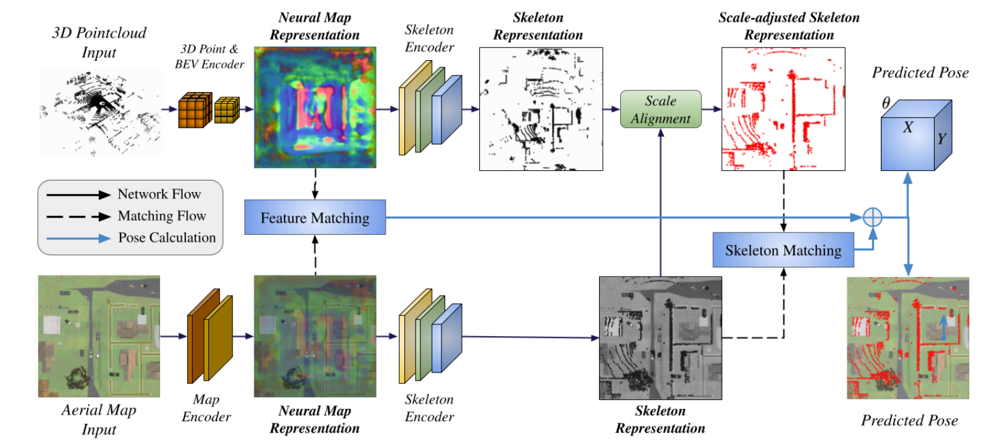

<p style="text-align:center;">

</p>

## Abstract
<div style="text-align: justify"> We present AGL-NET, a novel learning-based method for global localization using LiDAR point clouds and satellite maps. AGL-NET tackles two critical challenges: bridging the representation gap between image and points modalities for robust feature matching, and handling inherent scale discrepancies between global view and local view. To address these challenges, AGL-NET leverages a unified network architecture with a novel two-stage matching design. The first stage extracts informative neural features directly from raw sensor data and performs initial feature matching. The second stage refines this matching process by extracting informative skeleton features and incorporating a novel scale alignment step to rectify scale variations between LiDAR and map data. Furthermore, a novel scale and skeleton loss function guides the network toward learning scale-invariant feature representations, eliminating the need for pre-processing satellite maps. This significantly improves real-world applicability in scenarios with unknown map scales. To facilitate rigorous performance evaluation, we introduce a meticulously designed dataset within the CARLA simulator specifically tailored for metric localization training and assessment.</div>
<br>

Please cite our work if you found it useful,

```
@article{guan2024agl,
  title={AGL-NET: Aerial-Ground Cross-Modal Global Localization with Varying Scales},
  author={Guan, Tianrui and Xian, Ruiqi and Wang, Xijun and Wu, Xiyang and Elnoor, Mohamed and Song, Daeun and Manocha, Dinesh},
  journal={arXiv preprint arXiv:2404.03187},
  year={2024}
}
```