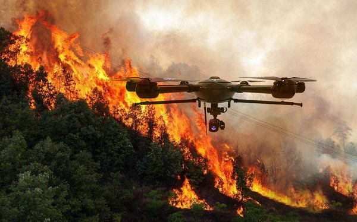

<p style="text-align:center;">

</p>

## Abstract
<div style="text-align: justify"> The purpose of this tutorial is to help individuals use the \underline{FireCommander} game environment for research applications. The FireCommander is an interactive, probabilistic joint perception-action reconnaissance environment in which a composite team of agents (e.g., robots) cooperate to fight dynamic, propagating firespots (e.g., targets). In FireCommander game, a team of agents must be tasked to optimally deal with a wildfire situation in an environment with propagating fire areas and some facilities such as houses, hospitals, power stations, etc. The team of agents can accomplish their mission by first sensing (e.g., estimating fire states), communicating the sensed fire-information among each other and then taking action to put the firespots out based on the sensed information (e.g., dropping water on estimated fire locations). The FireCommander environment can be useful for research topics spanning a wide range of applications from Reinforcement Learning (RL) and Learning from Demonstration (LfD), to Coordination, Psychology, Human-Robot Interaction (HRI) and Teaming. There are four important facets of the FireCommander environment that overall, create a non-trivial game: (1) Complex Objectives: Multi-objective Stochastic Environment, (2)Probabilistic Environment: Agents' actions result in probabilistic performance, (3) Hidden Targets: Partially Observable Environment and, (4) Uni-task Robots: Perception-only and Action-only agents. The FireCommander environment is first-of-its-kind in terms of including Perception-only and Action-only agents for coordination. It is a general multi-purpose game that can be useful in a variety of combinatorial optimization problems and stochastic games, such as applications of Reinforcement Learning (RL), Learning from Demonstration (LfD) and Inverse RL (iRL).</div>
<br>

| Paper                                         | Slide                                                   | Code                                                      |
|-----------------------------------------------|---------------------------------------------------------|-----------------------------------------------------------|
| [**FireCommander2020**](https://arxiv.org/pdf/2011.00165.pdf) | [**Slide**]('../files/FireCommander2020_Xiyang_Wu.pdf') | [**Code**](https://github.com/EsiSeraj/FireCommander2020) |

<br>

Please cite our work if you found it useful,

```
@misc{seraj2021firecommander,
      title={FireCommander: An Interactive, Probabilistic Multi-agent Environment for Heterogeneous Robot Teams}, 
      author={Esmaeil Seraj and Xiyang Wu and Matthew Gombolay},
      year={2021},
      eprint={2011.00165},
      archivePrefix={arXiv},
      primaryClass={cs.RO}
}
```
