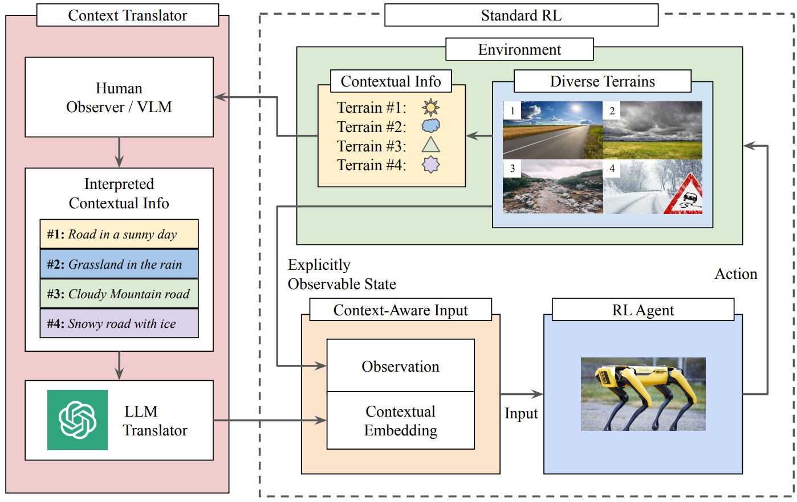

<p style="text-align:center;">

</p>

## Abstract
<div style="text-align: justify"> Navigating robots through unstructured terrains is challenging, primarily due to the dynamic environmental changes. While humans adeptly navigate such terrains by using context from their observations, creating a similar context-aware navigation system for robots is difficult. The essence of the issue lies in the acquisition and interpretation of contextual information, a task complicated by the inherent ambiguity of human language. In this work, we introduce LANCAR, which addresses this issue by combining a context translator with reinforcement learning (RL) agents for context-aware locomotion. LANCAR allows robots to comprehend contextual information through Large Language Models (LLMs) sourced from human observers and convert this information into actionable contextual embeddings. These embeddings, combined with the robot's sensor data, provide a complete input for the RL agent's policy network. We provide an extensive evaluation of LANCAR under different levels of contextual ambiguity and compare with alternative methods. The experimental results showcase the superior generalizability and adaptability across different terrains. Notably, LANCAR shows at least a 7.4% increase in episodic reward over the best alternatives, highlighting its potential to enhance robotic navigation in unstructured environments.</div>
<br>

| Paper                                         | Project Website                                          | 
|-----------------------------------------------|----------------------------------------------------------|
| [**LANCAR**](https://arxiv.org/abs/2310.00481) | [**Project Website**](https://raaslab.org/projects/LLM_Context_Estimation/) | 

<br>

Please cite our work if you found it useful,

```
@article{shek2023lancar,
  title={LANCAR: Leveraging Language for Context-Aware Robot Locomotion in Unstructured Environments},
  author={Shek, Chak Lam and Wu, Xiyang and Manocha, Dinesh and Tokekar, Pratap and Bedi, Amrit Singh},
  journal={arXiv preprint arXiv:2310.00481},
  year={2023}
}
```