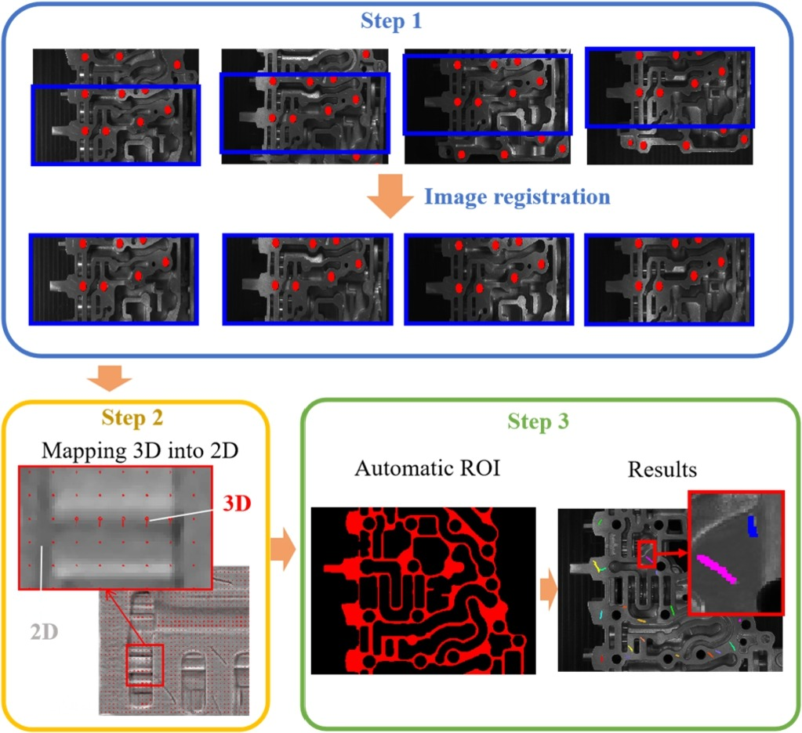

<p style="text-align:center;">

</p>

## Abstract
<div style="text-align: justify"> The adoption of three-dimensional (3D) measurement technology for parts surface defect detection can improve inspection reliability. For online inspection purposes, 3D measurement technologies must possess the characteristics of high speed and high efficiency. The photometric stereo method is a potential 3D measurement method with high speed and low cost. However, the traditional photometric stereo method is unsuitable for dynamic scenes due to its initial design for static scenes. In this paper, we propose a novel dynamic photometric stereo method based on an image registration method. To achieve fast speed and high efficiency, we reduce the computational cost by automatically generating regions of interest (ROI). Additionally, we innovatively map the depth information (the surface normal vectors) to a mean curvature map of the surface and use it to detect defects, which combines the robustness of 3D methods and the fast speed of 2D methods. We designed experiments and the results showed that our method can detect defects on the surfaces of aluminum alloy castings accurately and robustly in an online manner. This paper also aims to reveal the importance of utilizing multidimensional information in high-speed online inspections. </div>
<br>

| Paper                                                                                      |
|--------------------------------------------------------------------------------------------|
| [**Photometric**](https://www.sciencedirect.com/science/article/abs/pii/S1051200423002609) |

<br>

Please cite our work if you found it useful,

```
@article{liu2023novel,
  title={A novel image registration-based dynamic photometric stereo method for online defect detection in aluminum alloy castings},
  author={Liu, Haoyue and Wu, Xiyang and Yan, Ning and Yuan, Shuaipeng and Zhang, Xiaodong},
  journal={Digital Signal Processing},
  volume={141},
  pages={104165},
  year={2023},
  publisher={Elsevier}
}
```